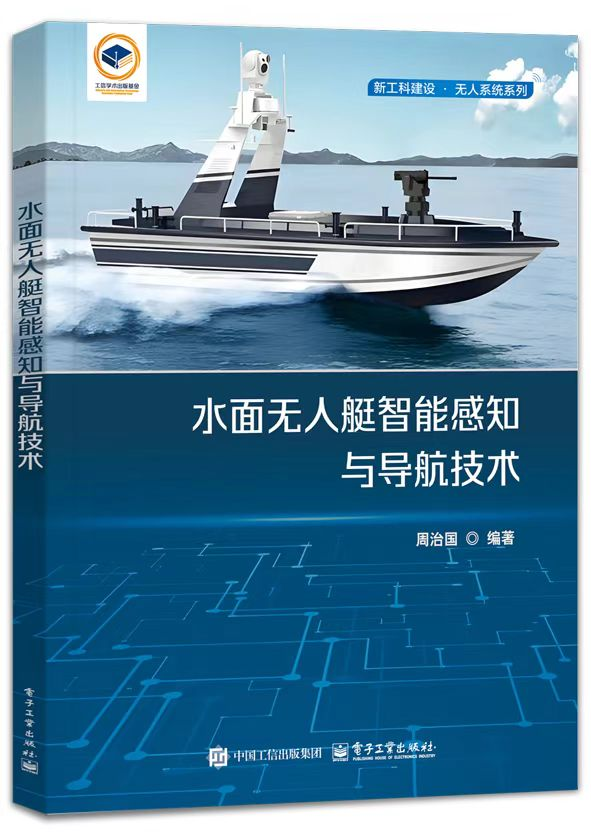

# Maritime-Intelligent-Navigation-2024
Open source data of maritime intelligent navigation platform
# 第十三届全国海洋航行器设计与制作大赛
## C4智能导航赛道（Maritime-Intelligent-Navigation）

本书在系统地介绍无人艇发展概况及系统架构等基本知识的基础上，着重介绍水面无人艇智能感知与导航技术。全书共6章，第1章着重介绍无人艇的发展概况和关键技术；第2章主要介绍无人艇的艇体设计及系统架构，并阐述无人艇感知系统；第3章为基于视觉的无人艇感知技术，主要介绍水面目标检测与跟踪算法；第4章主要介绍基于激光雷达的无人艇感知技术；第5章主要介绍无人艇路径规划技术；第6章主要介绍无人艇算法的训练与测试。本书适合作为高等工科院校电子信息工程、自动化、船舶与海洋工程专业高年级本科生、研究生的教材，同时可供对无人艇控制、智能导航比较熟悉且对无人系统虚拟仿真训练有所了解的开发人员和研究人员参考。

#### 线上开源培训课程链接

 您可以在这里获取线上赛前培训课程：[课程链接](https://www.zhihuishu.com/virtual_portals_h5/virtualExperiment.html#/indexPage?courseId=2000092634)，快速上手基于unity的无人艇强化学习导航避障训练环境平台
 #### 训练环境Unity工程文件获取链接
 您可以在这里获取搭建Unity仿真环境的开源工程链接：[工程链接](https://pan.baidu.com/s/1VWEVSLpuW6CNF9cia6apSw)，提取码：1234，快速下载unity无人艇强化学习导航避障训练环境工程。

## Maritime-Intelligent-Navigation仓库简介
* 该仓库是全国海洋航行器设计与制作大赛C4智能导航赛道的仿真环境源代码和文档所在地。
* 支持在unity提供的海洋环境中模拟无人艇导航与避障训练。
* 与全国海洋航行器设计与制作大赛组织者协调设计，该项目提供与现在和未来该项比赛中C4赛道类似的竞技场和任务，可以通过百度网盘链接获取unity平台的仿真环境工程文件。
* 对于C4智能导航的参赛者，此模拟环境旨在作为在物理水上测试之前开发工具原型解决方案的第一步。

## Maritime-Intelligent-Navigation平台支撑
   **平台基于 Unity 和 ML-Agents**
* Unity是Unity Technologies公司开发的一款专业的综合型开发引擎，具有强大的跨平台特性与基于物理的 3D 渲染效果。Unity支持多种脚本语言开发,同时具备视觉化编辑、动态预览和实时参数修改的功能，其内置物理引擎可以模拟真实航行环境的物理效果。此外，Unity还支持DRL算法的训练与测试，在构建航行环境和无人艇运动模型方面具有出色的效果。
* ML-Agents是一个开源工具包，用于在Unity环境中进行强化学习和机器学习的研究和开发。它为开发者提供了一套API和工具，可以在Unity中创建智能体（Agents），定义它们的行为和学习算法，并与环境进行交互。使用ML-Agents，可以利用强化学习算法（如Proximal Policy Optimization和Deep Q-Network等）来训练智能体。ML-Agents提供了与TensorFlow和PyTorch等主流机器学习框架的集成，使开发者可以使用自己喜欢的框架来实现算法。

## C4智能导航赛道
* 该环境是第十三届全国海洋航行器设计与制作大赛C4智能导航赛道的仿真环境，您可以访问我们的赛道网址获取最新资讯：[海上智能导航赛道](https://hangxingqi2023.github.io/Maritime-Intelligent-Navigation/)。

## 上手指南
 * [智能导航上手指南](https://spaitlab.github.io/Maritime-Intelligent-Navigation-2024/%E5%BF%AB%E9%80%9F%E4%B8%8A%E6%89%8B%E6%8C%87%E5%8D%97/) 提供文档和教程。
 * 该说明文档进行了详细的解释。如果您从零基础开始，熟悉这些工具，请不用担心，我们的快速上手指南会教会您如何在Unity环境下跑起来自己的无人艇强化学习避障算法
 * 对于技术问题，可以给我们留言描述您的问题或请求支持。
 

## 版权信息和使用要求
 * 版权所有 (c) [2023] [北京理工大学]
 * 未经许可，禁止复制、修改、合并、发布、分发、再许可和/或销售本软件及其副本。
 * 如果你有意使用本项目或其中的代码，请遵守以下要求：  
&emsp;1. 在你的项目文档、代码文件或其他适当的位置明确注明本项目的来源，包括项目名称和作者姓名。  
&emsp;2. 在任何派生作品中，保留本项目中的版权声明和许可声明。  
&emsp;3. 在使用本项目的基础上开展商业活动或进行任何盈利行为之前，必须事先获得作者的书面许可。  
&emsp;4. 作者不对使用本项目而导致的任何损害或纠纷负责。  

## 加入我们
* 该项目正在积极开发中，以支持全国海洋航行器设计与制作大赛的C4赛道。 我们一直在添加和改进东西。 我们的主要重点是提供无人艇和Unity仿真环境，也欢迎大家围绕他们的特定用例开发额外的功能。

* 如果您对这些主题有任何疑问，或者想在其他方面开展工作，您可以直接联系我们（见下文），也可以提交一个[issue](https://github.com/spaitlab/Maritime-Intelligent-Navigation-2024/issues)，或者提交一个[pull
 request](https://github.com/spaitlab/Maritime-Intelligent-Navigation-2024/pulls)！

## 联系我们

* 智能无人航行器实验室：13366005075 / 840665161@qq.com
* 大赛交流QQ群：711509724
