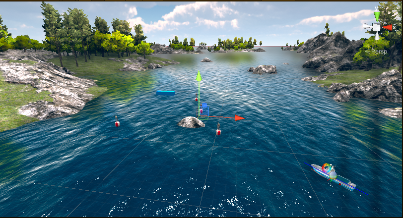

### Unity开放环境模型获取链接

百度网盘链接：[https://pan.baidu.com/s/1dz6PhY-JvUe0cCGLYl-Vjw ](https://pan.baidu.com/s/1dz6PhY-JvUe0cCGLYl-Vjw )

提取码：etk0

### 智慧树参考课程链接
[https://www.zhihuishu.com/virtual_portals_h5/virtualExperiment.html#/indexPage?courseId=2000092634](https://www.zhihuishu.com/virtual_portals_h5/virtualExperiment.html#/indexPage?courseId=2000092634)

### Unity训练场景

&emsp;&emsp;训练强化学习智能体(Agent)首先需要根据任务需求在Unity中搭建一个训练场景作为强化学习中的环境。在下载的工程中已搭建了一个示例场景。

### Unity环境航行测试效果

&emsp;&emsp;风浪仿真环境下的测试效果 

&emsp;&emsp;未知环境下无人艇避障仿真训练 

